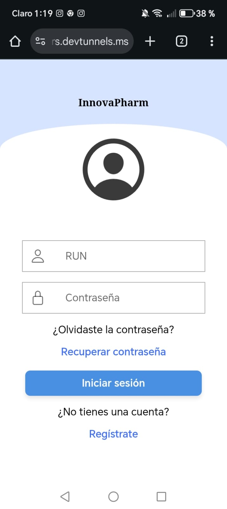
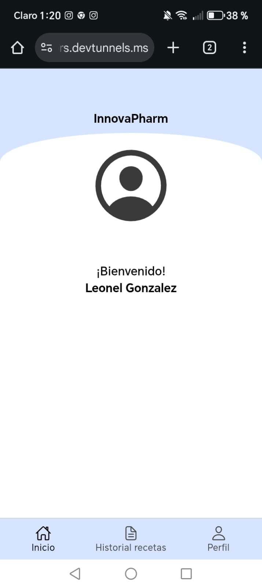
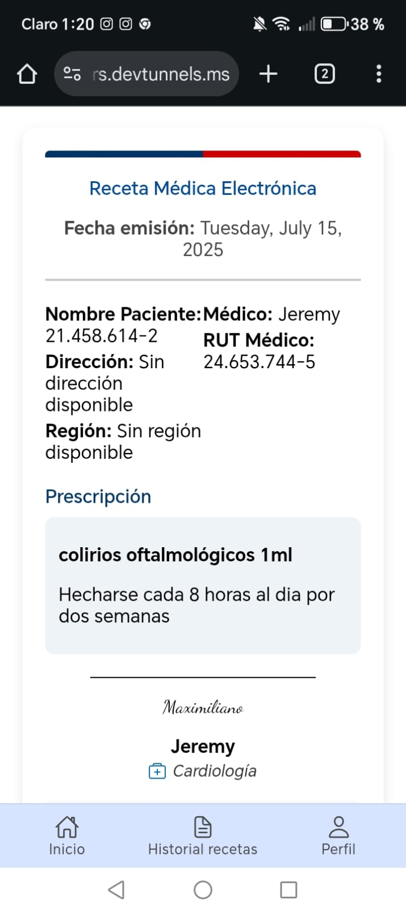
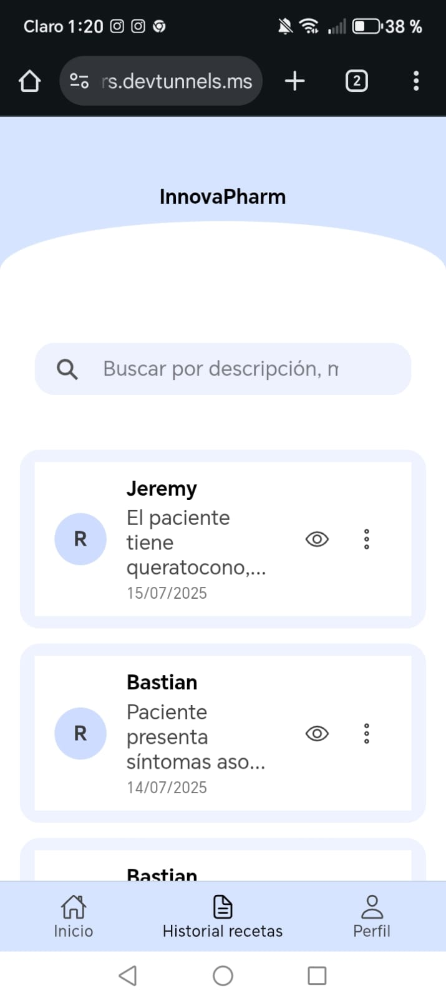
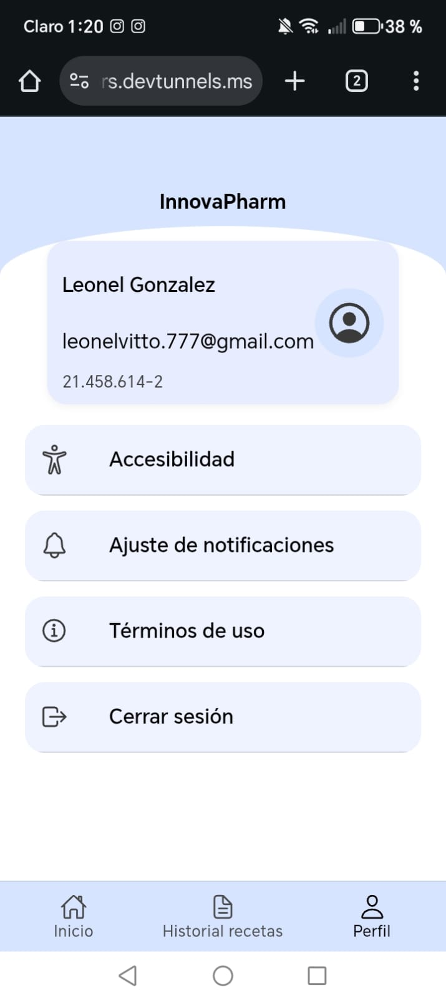
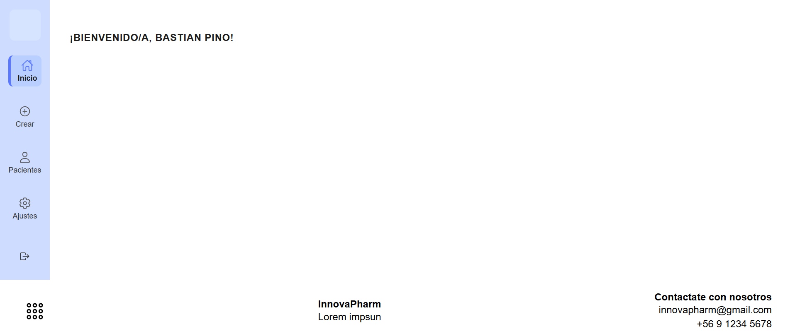
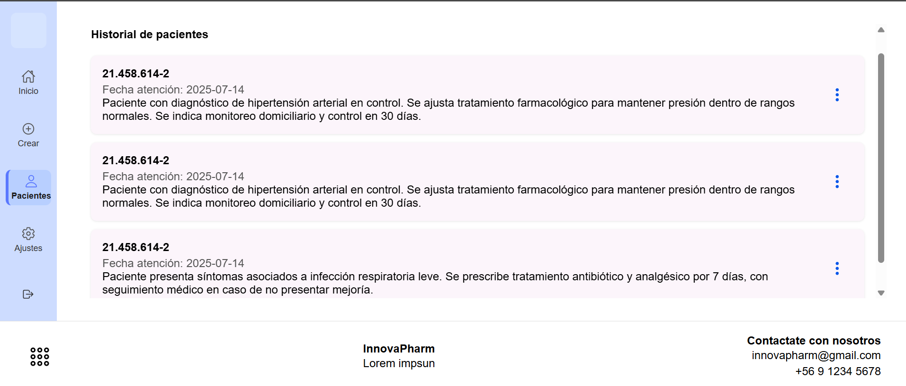
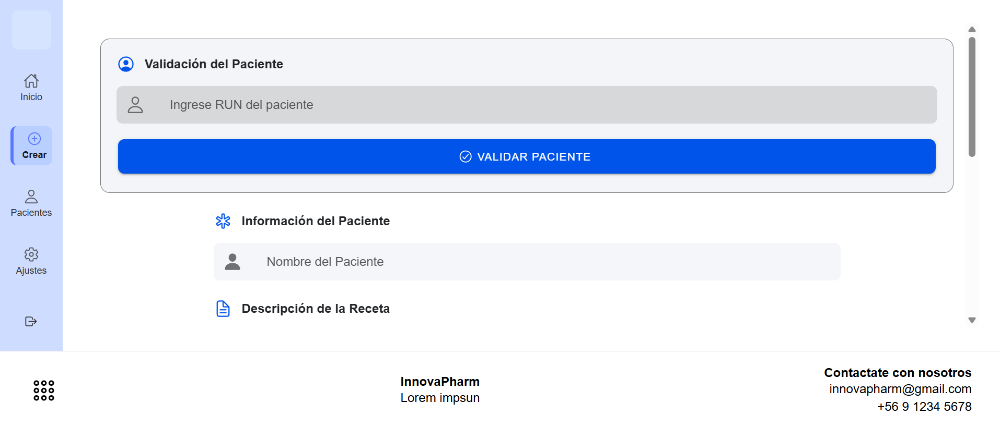

# 💊 InnovaPharm - Sistema Digital de Recetas Médicas

> **Aplicación web/móvil híbrida y panel administrativo para la digitalización, gestión y validación de recetas médicas en el Consultorio Raúl Brañes Farmer de San Bernardo.**

---

## 📌 Tabla de Contenidos
- [Acerca del Proyecto](#-acerca-del-proyecto)
- [Problemática y Solución](#-problemática-y-solución)
- [Características Principales](#-características-principales)
- [Arquitectura y Tecnologías](#-arquitectura-y-tecnologías)
- [Metodología de Desarrollo](#-metodología-de-desarrollo)
- [Aseguramiento de Calidad y Normativas](#-aseguramiento-de-calidad-y-normativas)
- [Estructura del Proyecto](#-estructura-del-proyecto)
- [Instalación y Configuración](#-instalación-y-configuración)

---

## 📖 Acerca del Proyecto

**InnovaPharm** es una solución tecnológica desarrollada con principios de Ingeniería de Software orientada a optimizar el ciclo completo de prescripción, trazabilidad y dispensación de medicamentos en el sistema de salud pública local.

El sistema resuelve las ineficiencias del manejo en papel mediante un ecosistema digital compuesto por una **App Híbrida Multiplataforma** para Pacientes, Médicos y Farmacéuticos, complementada con un **Panel Administrativo en Django** para la gestión centralizada de usuarios y métricas.

---

## ⚠️ Problemática y Solución

| Problemática Actual (Papel) | Solución InnovaPharm |
| :--- | :--- |
| Pérdida, deterioro o rotura de recetas físicas. | Recetas digitales almacenadas y accesibles 24/7. |
| Falsificación de firmas y recetas vencidas. | Validación mediante **Código QR único** y control de estados. |
| Errores de transcripción y legibilidad de letra. | Formularios estandarizados e interfaz intuitiva. |
| Falta de trazabilidad en la entrega de medicamentos. | Historial centralizado para el médico, farmacéutico y paciente. |

---

## ✨ Características Principales

El sistema maneja un control de acceso basado en roles (**RBAC**):

### 👤 Paciente
- Visualización y filtrado de recetas médicas activas e históricas.
- Generación de código QR para validación directa en farmacia.
- Notificaciones de vencimiento y estados.
- Opciones de accesibilidad (modo oscuro, ajuste de tamaño de texto).

### 👨‍⚕️ Médico
- Emisión, firma electrónica y anulación/actualización de recetas.
- Descarga de recetas en formato PDF.
- Búsqueda y consulta de historial clínico de prescripciones.

### 💊 Farmacéutico
- Escaneo de QR o búsqueda por código único de receta.
- Validación rápida e interfaz para marcar recetas como **Revisadas** o **Entregadas**.

### ⚙️ Administrador (Django Admin)
- Creación y gestión masiva de usuarios y roles.
- Generación automática de credenciales seguras.
- Dashboard con métricas de rendimiento y uso de la plataforma.

---

## 📱 Vista Móvil (Paciente)

<p align="center">
  
  
  
</p>

<p align="center">
  
  
</p>

---

## 💻 Vista Web (Médico)

<p align="center">
  
  
  
</p>

---

## 💻 Vista Web o Movil (Farmacéutico)

<p align="center">
  
  
  
  
</p>

---

## 🛠️ Arquitectura y Tecnologías

### Frontend & App Híbrida
- **Ionic Framework + Angular:** Base de código única para Android, iOS y Web.
- **Figma:** Diseño UI/UX centrado en accesibilidad para adultos mayores.

### Backend, Base de Datos y Autenticación
- **Django:** Panel administrativo, gestión de usuarios y API.
- **Firebase:** Autenticación segura y almacenamiento de información.

### Calidad y Testing
- **Apache JMeter:** Pruebas de carga, rendimiento y estrés.
- **Git & GitHub:** Control de versiones y colaboración.

---

## 🔄 Metodología de Desarrollo

El proyecto se desarrolló utilizando la metodología ágil **Scrum**, organizada en **5 Sprints de dos semanas**:

- **Sprint 1:** Configuración inicial, arquitectura y autenticación.
- **Sprint 2:** Gestión de datos del paciente y generación de códigos QR.
- **Sprint 3:** Desarrollo del módulo de prescripción y recetas digitales.
- **Sprint 4:** Implementación de visualización, filtros e historial.
- **Sprint 5:** Integración general, notificaciones, pruebas y cierre del proyecto.

---

## 🛡️ Aseguramiento de Calidad y Normativas

El desarrollo fue guiado bajo los criterios de la norma **ISO/IEC 25010**, considerando:

- **Seguridad:** Cifrado de datos sensibles (RUT, firmas e historial médico), cierre automático de sesión y bloqueo por intentos fallidos.
- **Rendimiento:** Tiempo de respuesta objetivo ≤ 4 segundos en redes móviles (4G) y disponibilidad superior al 95%.
- **Usabilidad:** Diseño responsivo, validaciones dinámicas y mensajes de error claros.

---

## 📁 Estructura del Repositorio

```text
├── innovapharm-frontend/    # Proyecto Ionic + Angular (Paciente, Médico y Farmacia)
├── innovapharm-backend/     # Panel Administrativo desarrollado en Django
├── docs/                    # Documentación técnica, diagramas y casos de prueba
└── README.md
